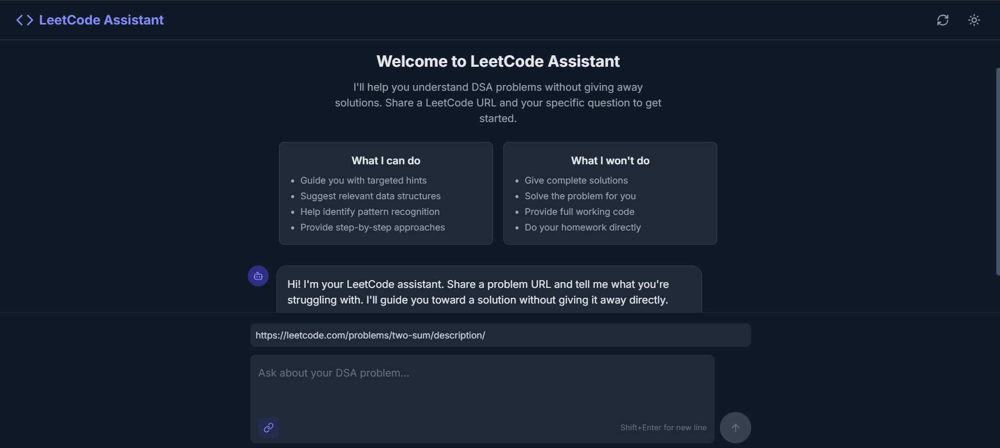

# LeetCode DSA Teaching Assistant

A modern, intuitive chat application built with TypeScript that helps users understand and solve Data Structures and Algorithms problems from LeetCode without giving away direct solutions.



## 🚀 Features

- **Guided Learning**: Receive step-by-step guidance for DSA problems without spoiling solutions
- **LeetCode Integration**: Submit any LeetCode problem URL for specific assistance
- **Concept Building**: Focus on building intuition and understanding rather than memorizing solutions
- **Interactive Chat**: Natural conversation flow with follow-up questions and clarifications
- **Dark/Light Mode**: Toggle between light and dark themes for comfortable coding at any time
- **Responsive Design**: Works beautifully on all devices from mobile to desktop

## 🛠️ Tech Stack

- **Frontend**: React with TypeScript
- **UI Design**: TailwindCSS for styling
- **API Integration**: OpenAI GPT API
- **State Management**: React Hooks (custom `useChat` hook)
- **Build Tool**: Vite

## 📋 Setup Instructions

### Prerequisites

- Node.js (v16+)
- npm or yarn
- OpenAI API key

### Installation

1. Clone the repository:
   ```bash
   git clone https://github.com/your-username/leetcode-assistant.git
   cd leetcode-assistant
   ```

2. Install dependencies:
   ```bash
   npm install
   ```

3. Create a `.env` file in the root directory with your OpenAI API key:
   ```
   VITE_OPENAI_API_KEY=your_openai_api_key_here
   ```

4. Start the development server:
   ```bash
   npm run dev
   ```

5. Open [http://localhost:5173](http://localhost:5173) in your browser to see the application.

## 🏗️ Architecture

The project follows a clean, modular structure for ease of maintenance and scalability:

```
leetcode-assistant/
├── src/
│   ├── components/         # UI components
│   │   ├── ChatBubble.tsx  # Message display
│   │   ├── ChatInput.tsx   # User input with URL field
│   │   ├── ChatWindow.tsx  # Main chat interface
│   │   └── Header.tsx      # App header with theme toggle
│   ├── hooks/
│   │   └── useChat.ts      # Custom hook for chat functionality
│   ├── services/
│   │   └── api.ts          # OpenAI API integration
│   ├── types/
│   │   └── index.ts        # TypeScript type definitions
│   ├── utils/
│   │   └── prompts.ts      # Prompt templates for learning
│   └── styles/
│       └── index.css       # Global styles with Tailwind
```

## 🧠 Teaching Methodology

The assistant uses a Socratic teaching approach focused on:

1. **Guiding, Not Solving**: Provides hints and directions without direct solutions
2. **Concept Reinforcement**: Connects problems to fundamental DSA principles
3. **Pattern Recognition**: Helps identify common algorithmic patterns
4. **Step-by-Step Thinking**: Breaks down complex problems into manageable steps
5. **Strategic Hints**: Offers progressively more specific hints when needed

## 📱 Usage Examples

### Basic Workflow

1. Enter a LeetCode problem URL in the URL field
2. Ask your specific question about the problem
3. Receive guided assistance that helps you understand the approach
4. Continue the conversation, asking for more specific hints as needed

### Example Questions

- "I don't understand how to approach this two-pointer problem. Where should I start?"
- "What data structure would be most efficient for this scenario?"
- "Can you help me understand the time complexity requirements?"
- "I'm struggling with the edge cases in this problem. Any hints?"

## 🚢 Deployment

Built with Vite, this application is easy to deploy on various platforms:

### Vercel Deployment
```bash
npm install -g vercel
vercel
```

### Netlify Deployment
```bash
npm install -g netlify-cli
netlify deploy
```

## 📝 License

This project is licensed under the MIT License - see the LICENSE file for details.
